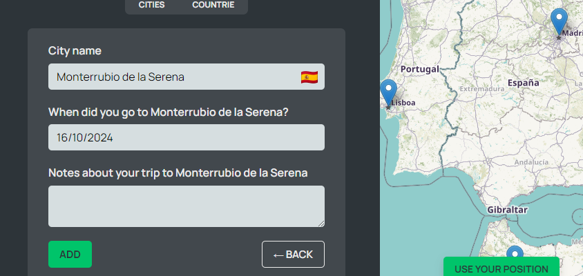

# React + Vite

This template provides a minimal setup to get React working in Vite with HMR and some ESLint rules.

Currently, two official plugins are available:

- [@vitejs/plugin-react](https://github.com/vitejs/vite-plugin-react/blob/main/packages/plugin-react/README.md) uses [Babel](https://babeljs.io/) for Fast Refresh
- [@vitejs/plugin-react-swc](https://github.com/vitejs/vite-plugin-react-swc) uses [SWC](https://swc.rs/) for Fast Refresh

  Up now i learned how to use React Route and how to call neste Route in a file with the help of the Outlet element. Inted of useState, in real apps we store data in the IP address of the app. Ex: localhost:5173/app/countries; 5173 is the address of the vite project, /app is the app page of the project and /countries is the nested Route that appears in the app page displaying the countries/ cities in the sidebar. Also learned the file distribution of the project, which one goe to the components directories and the pages directories. An important part of the lectures was the CSS modules. Besides the index.css script that is a global css file, applying to every jsx file, evevy component or page, like AppNav.jsx, has a css module script with the same name as the jsx file, AppNav.module.css that is unique to the coresponding jsx file. So the css is wrote only tothat file and ca.t be accessed to other jsx files.

  Configured the server from the data directory cities.json.
  Steps: installing json-server -> npm run server
  -> in the package.json: in the scripts: "server": "json-server --watch data/cities.json --port 9000 --delay 500"

Creating cities: when clicking in a place on the map the latitude and longitude is updating appearing in the form the citys name from that coordinate. The city is created with the context API which is used with the useCities hook for simplicity.

The add button will trigger the createCity function which xecutes a post request of the data in the JSON file and adds the new city to the state( to be in sink with the remote state).
